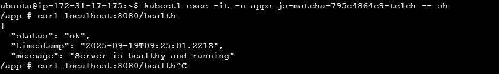
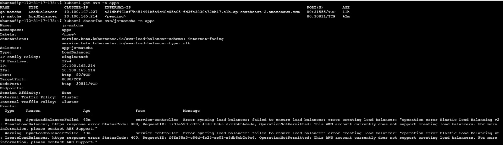
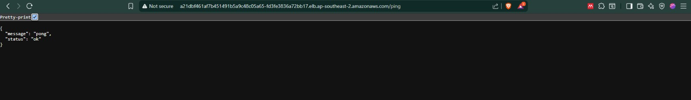

# Matcha Apps Deployment (Go + Node.js) on AWS EKS with Jenkins CI/CD
this repository is for cicd dummy by matcha

## 📌 Approach to Solving the Problem
matcha designed an end-to-end CI/CD workflow to automate the build, push, and deployment of applications to AWS EKS:

1. **Containerization**  
   - `main.go` app in `golang/` → Dockerized using a multi-stage Go build.  
   - `index.js` app in `nodejs/` → Dockerized with Node.js Alpine image.  

2. **Image Registry**  
   - All Docker images are pushed to **Amazon Elastic Container Registry (ECR)**.  
   - Each build is tagged with both `:latest` and `:<git-sha>`.

3. **CI/CD with Jenkins**  
   - Jenkins runs on EC2 with an IAM Role that has permissions for **ECR** and **EKS**.  
   - Pipeline stages: checkout → build image → push to ECR → update Kubernetes manifests → deploy to EKS.

4. **Deployment on EKS**  
   - Applications are deployed with Kubernetes **Deployment** manifests.  
   - Exposed with Kubernetes **Service**:
     - `type: LoadBalancer` → preferred (creates AWS NLB with external DNS).  
     - `type: NodePort` → fallback (open worker node SG and access via `<nodeIP>:<nodePort>`).

5. **Ingress & DNS (future)**  
   - Once ELB creation is fully enabled, matcha can bind ACM TLS certs and use Cloudflare DNS to map domain names (e.g., `app.ely.my.id`) to the ALB/NLB endpoint.

---

## 🔄 CI/CD Pipeline Workflow

**Pipeline Stages:**

1. **Checkout**  
   - Pull source code from GitHub (connected via SSH key).

2. **Login to ECR**  
   - `aws ecr get-login-password` to authenticate Docker client.

3. **Build & Push Image**  
   - Docker build with `golang/Dockerfile` or `nodejs/Dockerfile`.  
   - Tag as `latest` and commit SHA.  
   - Push to ECR repo (`$ACCOUNT_ID.dkr.ecr.$REGION.amazonaws.com/matcha-repo`).

4. **Deploy to EKS**  
   - `aws eks update-kubeconfig` to connect cluster.  
   - Update image reference in `Deployment` manifest to new ECR image.  
   - Apply manifests (`deploy.yaml`, `svc-lb.yaml` or `svc-nodeport.yaml`).  
   - Wait for rollout success.

5. **Expose Publicly**  
   - **LoadBalancer**: external DNS auto-provisioned by AWS (`.elb.amazonaws.com`).  
---

## ▶️ How to Run/Test the Solution

### 1. Prerequisites
- AWS account with EKS, ECR enabled.
- EC2 for Jenkins with:
  - Docker installed (`docker ps` works as `jenkins` user).
  - AWS CLI & kubectl installed.
  - IAM Role with:
    - `AmazonEC2ContainerRegistryPomatcharUser`
    - `AmazonEKSClusterPolicy`
    - `AmazonEKSClusterAdmin` access entry in EKS.

### 2. Build & Push (from Jenkins pipeline)
Trigger Jenkins job → pipeline automatically:
- Builds Docker image
- Pushes to ECR
- Updates EKS manifests
- Deploys to cluster

Check logs in Jenkins → final stage prints the public URL.

### 3. Verify Deployment
```bash
kubectl -n apps get pods
kubectl -n apps get svc
```
### 4. Browser Test

Open the URL in a browser:

Jenkins → http://ec2-3-27-135-93.ap-southeast-2.compute.amazonaws.com:8080/ 
u: matcha
p: matcha

Go app (Go-Matcha) → http://a21dbf461af7b451491b5a9c48c05a65-fd3fe3836a72bb17.elb.ap-southeast-2.amazonaws.com/ping
Js app (Js-Matcha) → http://ac5a7f9e938d145199ac31828b2e0207-3c1a153ef54e22c1.elb.ap-southeast-2.amazonaws.com/ping
 

##  📊 Lampiran
aplikasi node.js yang pending loadbalancernya





## Bonus Design Monitoring integrate with LOKI opensource
```bash
                   Git (observability-infra repo)
                              │
                              ▼
                       Argo CD (EKS)
                   ┌─────────────────┐
                   │ Apps of Apps    │
                   │ - kube-prom-stack (Prometheus+Alertmanager)
                   │ - loki          (writes to S3)
                   │ - promtail      (scrape node/container logs)
                   │ - grafana       (dashboards, datasource Loki+Prometheus)
                   └─────────────────┘
    Workloads      ▲                ▲                 ▲
  (go-matcha,      │                │                 │
   js-matcha, ...) │ logs (stdout)  │ metrics         │ dashboards/alerts
                   │                │                 │
              ┌────┴────┐       ┌───┴─────┐     ┌─────┴─────┐
              │ Promtail│  ==>  │  Loki   │ ==> │  Grafana  │
              └─────────┘       └─────────┘     └───────────┘
                                    │
                                    ▼
                                   S3
```


